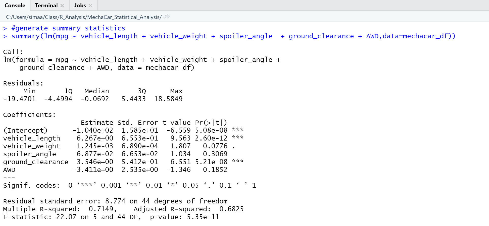
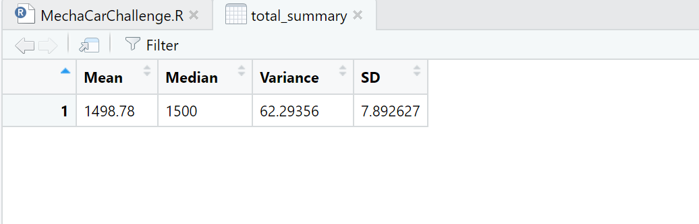
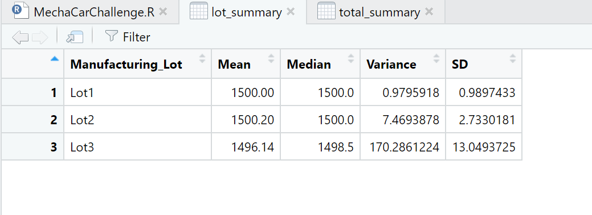

# MechaCar_Statistical_Analysis

## Linear Regression to Predict MPG

-Which variables/coefficients provided a non-random amount of variance to the mpg values in the dataset?

- Vehicle length, ground clearance and Intercept provided a non-random amount of variance to the mpg values in the dataset. he two variables that had the most amount of random variance are ground_clearance and vehicle_length.

-Is the slope of the linear model considered to be zero? Why or why not?

- The slope is not zero just be looking at the p-value, which is less than 0.05.The p-value of this linear model is 5.35e-11, which is much smaller than the assumed significance level of 0.05%.

-Does this linear model predict mpg of MechaCar prototypes effectively? Why or why not?

- R-squared value is 71%, which means roughly ~71% of the time the model will predict mpg values correctly. There are probably other factors that were not captured in the datasaet that contribute to the mpg variability of the MechaCar prototypes.

- Output of the console

Linear Regression summary

## Summary Statistics on Suspension Coils
The design specifications for the MechaCar suspension coils dictate that the variance of the suspension coils must not exceed 100 pounds per square inch. Does the current manufacturing data meet this design specification for all manufacturing lots in total and each lot individually? Why or why not?

Based on the figures below we can infer that the data is normally distributed because mean and median are very close.

## T-Tests on Suspension Coils

all

lot1

lot2

lot3

## Study Design: MechaCar vs Competition

One of the metrics that a consumer would be intersted in when choosing a car is engine power, so I decided to focus on horsepower and how it can effect consumer's decision to choose MechaCar over its competition.

H0: There is no significant difference between the preference of the horsepower of the cars.
H1: There is a significant difference between the preference of the horsepower of the cars.

